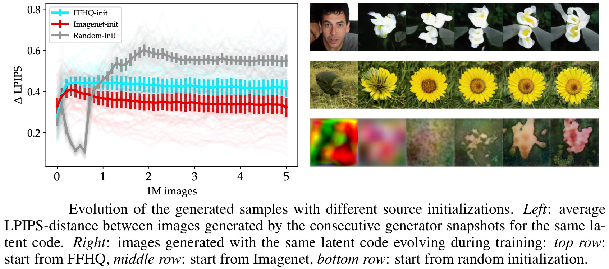

# When, Why, and Which Pretrained GANs Are Useful?

This repository contains supplementary code for the ICLR'22 paper [_When, Why, and Which Pretrained GANs Are Useful?_](https://openreview.net/forum?id=4Ycr8oeCoIh) by Timofey Grigoryev*, Andrey Voynov*, and Artem Babenko.

__TL;DR__:

The paper aims to dissect the process of GAN finetuning. The take-aways:
* Initializing the GAN training process by a pretrained checkpoint primarily affects the model's coverage rather than the fidelity of individual samples;
* Measuring a recall between source and target datasets is a good recipe to choose an appropriate GAN checkpoint for finetuning;
* For most of the target tasks, Imagenet-pretrained GAN, despite having poor visual quality, is an excellent starting point for finetuning.

<br/>

<p align="center">

</p>

# Code

Here we release the StyleGAN-ADA Imagenet checkpoints at different resolutions that commonly act as superior model initialization. These checkpoints are compatible with the [official StyleGAN-ADA repository](https://github.com/NVlabs/stylegan2-ada-pytorch)

[StyleGAN-ADA-128](https://www.dropbox.com/s/d6o9lr1inzwy7jh/imagenet-128-state.pt?dl=0)

[StyleGAN-ADA-256](https://www.dropbox.com/s/7gll7weysn1ull7/imagenet-256-state.pt?dl=0)

[StyleGAN-ADA-512](https://www.dropbox.com/s/94rbsuo1cjghxsf/imagenet-512-state.pt?dl=0)

We also release the GAN-transfer playground code.

## Citation

```
@misc{www_gan_transfer_iclr22,
      title={When, Why, and Which Pretrained GANs Are Useful?}, 
      author={Timofey Grigoryev and Andrey Voynov and Artem Babenko},
      year={2022},
      eprint={2202.08937},
      archivePrefix={arXiv},
      primaryClass={cs.LG}
}
```
